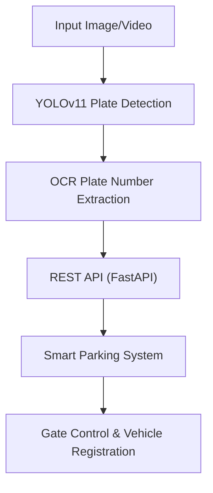

#  Smart Parking

Smart Parking is an intelligent parking management system designed to streamline the search for parking in crowded areas. Leveraging machine learning and real-time camera input, Smart Parking detects car plates at entry gates, automates vehicle registration, and enables users to locate and reserve available spaces through a dedicated mobile application.

---

## 🚀 Features

- **📸 Car Plate Detection**  
  Real-time license plate recognition utilizing YOLO and Python for accurate and fast detection.

- **🔐 Automatic Gate Access Control**  
  Seamless entry and exit automation based on vehicle registration and plate recognition.

- **📱 Mobile App (Flutter)**  
  Cross-platform mobile application provides users with real-time parking space availability.

- **🛒 Store Selection & Navigation**  
  Recommends the nearest parking spot based on the user's selected destination, ensuring convenience.

- **🎯 Reservation System**  
  Allows users to reserve parking spots in advance, minimizing wait times and improving user experience.

---

## 🛠️ Technologies Used

  
  
  
  
  

- **Python** – Backend logic and image processing  
- **FastAPI** – High-performance API development  
- **Flutter** – Cross-platform mobile application  
- **YOLO** – Real-time car plate detection (You Only Look Once)  
- **Machine Learning** – Object detection and system intelligence

________________________________________________________________________

#Car Plate Detection Model

## Overview

Welcome to the **Car Plate Detection Model** !  
. The system leverages YOLOv11 for car plate detection and integrates Optical Character Recognition (OCR) for precise plate number extraction, enabling automated gate access and vehicle registration.

---

## Features

- **AI-Powered Plate Detection:**  
  Utilizes YOLOv11 for robust and accurate car plate localization.

- **High-Quality Dataset:**  
  Trained and validated on the Roboflow Plate Dataset, comprising 2,600 expertly annotated images.

- **Accurate Plate Number Extraction:**  
  Employs advanced OCR techniques to read plate numbers from detected regions with high precision.

- **REST API Deployment:**  
  FastAPI-based backend serves real-time detection and recognition results via RESTful endpoints.

- **Smart Parking Integration:**  
  Seamless integration with parking management systems for automatic gate control and vehicle registration.

- **Performance Monitoring:**  
  Comprehensive evaluation using confusion matrices, accuracy metrics, and visualization tools.

- **Continuous Improvement:**  
  Detection accuracy enhanced through iterative model fine-tuning and OCR post-processing.

- **Version Control and Documentation:**  
  All development, experiments, and results are tracked and managed using GitHub.

---

## Architecture

---

## Dataset

- **Source:** Roboflow Plate Dataset  
- **Size:** 2,600 annotated images  
- **Preparation:** Downloaded, cleaned, and split for training and validation.

---

## Results

### Results 

### 📊 Confusion Matrix

### 📈 Results Summary

- **Detection Accuracy:** High precision and recall for plate detection.
- **OCR Performance:** Minimized misreadings through post-processing and fine-tuning.
- **System Throughput:** Real-time performance suitable for live parking environments.

---

## Contact

**AI Engineer:** [mohamed-ehab415](https://github.com/mohamed-ehab415)
