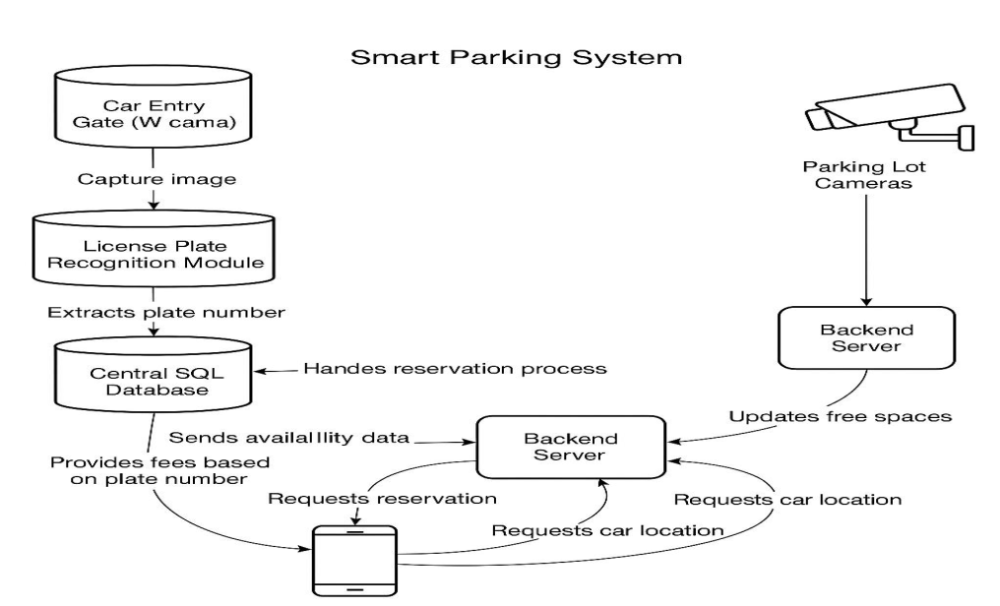

#  Smart Parking

  

# 🚗 Smart Parking System

Smart Parking is an **AI-powered parking management system** designed for shopping malls.  
It helps drivers save time by automatically detecting vacant spaces, recognizing license plates, and allowing users to reserve and locate their cars through a mobile app.

### 🔍 Problem
Finding a parking spot in crowded areas wastes time and causes unnecessary traffic.  

### 🎯 Solution
Our system combines **real-time camera data**, **AI models**, and a **mobile application** to automate:
- Detecting available parking spots
- Vehicle registration via license plate recognition
- Reservation & navigation through the mobile app

### ✨ Expected Outcome
- Faster & easier parking experience  
- Optimized space utilization  
- Reduced congestion inside malls  
- Higher customer satisfaction 🚀

## 🏙️ Introduction

During peak hours and weekends, drivers often waste a lot of time circling around to find a free parking spot.  
This leads to:
- Delays & dissatisfaction  
- Traffic congestion at mall entrances  
- Higher fuel consumption  
- Reduced mall sales due to lost foot traffic  

**Smart Parking** solves this by providing a **fully automated AI-powered system** for malls.  
The main goals are:
- ⏱️ Reduce waiting time  
- 🅿️ Detect available parking spots in real-time using AI  
- 📱 Allow users to **reserve spots** and **locate their cars** via a mobile app  
- 🛍️ Recommend parking areas nearest to the user’s target store  

This eliminates human intervention in parking management, **improves traffic flow**, and enhances both **service quality** and **operational efficiency** for mall operators.  

---

## 🔬 Contribution & Innovation

Unlike traditional systems that depend on **manual work** or **ultrasonic sensors**, Smart Parking uses **machine learning & computer vision** to:  
- Detect available spaces in real time  
- Recognize license plates at entry gates with high accuracy  
- Suggest the best parking spot closest to the user’s destination  

📱 The mobile app adds extra value:
- Live parking availability  
- Advance spot reservation  
- “Find my car” feature  

From a **research & industry perspective**, this project contributes to the fields of **smart cities** and **intelligent mobility** by:  
- Introducing a scalable, retrainable AI model adaptable to malls, airports, universities, and hospitals  
- Storing anonymized parking data for future analytics & optimization  
- Providing a practical implementation of **AI-based space optimization** in real-world environments 🚀  

## 🔗 Related Work

Several smart parking systems have been developed to tackle urban traffic and parking optimization.  

- **Sensor-based systems**: Use ultrasonic or infrared sensors for each spot. Effective in garages/airports, but **costly** and hard to scale in open areas like malls.  
- **Mobile apps (e.g., ParkMobile, JustPark, ParkPlus)**: Provide reservations and payments, but rely on manual input or static data — **no real-time detection** or automatic recognition.  
- **Recent research**: Explores AI & computer vision with CCTV, but most remain at **prototype stage**, focusing only on availability detection (no user interaction or reservations).  

🚀 **Our Smart Parking system** goes beyond these limitations by combining:  
- AI-powered real-time space detection  
- License plate recognition  
- Mobile app with reservations, guidance, and destination-based suggestions  
- Full automation with **minimal infrastructure**  

---

### 📊 Comparative Analysis

| Feature                          | ParkMobile / JustPark | Sensor-Based Systems | 🚗 Proposed Smart Parking |
|----------------------------------|-----------------------|----------------------|----------------------------|
| Real-time space detection        | ❌ No                 | ✅ Yes (with sensors) | ✅ Yes (AI + Computer Vision) |
| License plate recognition        | ❌ No                 | ❌ No                | ✅ Yes |
| Mobile reservation               | ✅ Yes                | ❌ No                | ✅ Yes |
| Infrastructure cost              | 💲 Low                | 💲💲💲 High          | 💲 Low |
| Destination-based guidance       | ❌ No                 | ❌ No                | ✅ Yes |
| Full automation (no human input) | ❌ No                 | ❌ No                | ✅ Yes |
| Scalability & flexibility        | ⚖️ Medium             | ⚖️ Limited          | ⚖️ High |

---

✅ Unlike existing systems, **Smart Parking** integrates real-time AI detection, license plate recognition, and user-centric features (like destination-aware parking suggestions) — all while keeping infrastructure cost low and ensuring full automation.

 ## 💻 Software Description

### 🏗️ Software Architecture
The Smart Parking system is built on a **modular, layered architecture** that combines:
- **Computer Vision & Machine Learning** for license plate recognition and space detection  
- **Cloud-based backend** for managing communication between modules  
- **Mobile application** for user interaction  

🔄 **Workflow**:
1. A car enters the mall → Surveillance camera captures the license plate  
2. **YOLOv11 + OCR** extracts the plate number → Sent to **FastAPI backend**  
3. Backend checks registration in **PostgreSQL** (or creates new entry)  
4. Parking area cameras → AI model (SVM + CV) detects empty spots  
5. Availability info stored in **central SQL DB** → Synced with mobile app in real time  

This architecture ensures **automation, scalability, and seamless user experience**.

            
---

### 🛠️ Tools & Technologies

| Tool / Technology | Purpose |
|-------------------|---------|
| **FastAPI**       | Lightweight backend API for communication between modules |
| **Flutter**       | Cross-platform mobile app (Android + iOS) |
| **PostgreSQL**    | Relational DB for users, plates, and parking spot data |
| **YOLOv11**       | License plate detection (trained with Roboflow dataset) |
| **OpenCV + OCR**  | Image processing & text extraction from plates |
| **SVM**           | Classification of free/occupied spots |
| **Roboflow**      | Dataset annotation, preprocessing, automated training |
| **Kaggle API**    | Cloud-based GPU training & inference jobs |
| **GitHub**        | Version control & collaboration |
| **VS Code**       | Development environment |

---

### ⚙️ Core Functionalities

1. **🔍 License Plate Recognition**  
   - Captures plate images at entry  
   - Processes them with **YOLOv11 + OpenCV + OCR**  
   - Stores extracted text in DB → Enables automated tracking  

2. **🅿️ Real-Time Parking Space Detection**  
   - Cameras monitor availability continuously  
   - **SVM + CV** detect free vs occupied spots  
   - Data instantly synced to DB & mobile app  

3. **📱 Mobile Application Integration (Flutter)**  
   - View available spots  
   - Reserve before arrival  
   - Get directions to nearest spot (based on destination inside mall)  
   - Receive reminders of where the car is parked  

4. **💳 Automatic Fee Estimation**  
   - Entry time logged via plate recognition  
   - On exit, system auto-calculates fee based on duration  
   - Displayed directly to user in app (no human interaction)  

5. **🗄️ Centralized Backend & Database**  
   - **FastAPI + PostgreSQL** handle all communication  
   - Ensures real-time updates between cameras, AI models, and mobile app  
   - Provides scalability & reliability  

---

 # ⚙️ 4. Methodology  

## 4.1 Data Collection and Preprocessing  

### 4.1.1 License Plate Dataset  
A custom dataset was created for license plate detection, the first step toward automating vehicle entry registration.  

- **Source**: Built using Roboflow with custom images manually annotated.  
- **Classes**: `license_plate`  
- **Annotation Method**: Bounding boxes using Roboflow’s tool.  

**Preprocessing Steps**  
- Resized to **640×640** (YOLOv11 input).  
- Normalized & converted to RGB.  
- Applied augmentation:  
  - Horizontal flipping  
  - Brightness/contrast adjustment  
  - Rotation (±15°)  

**Dataset Split**  

| Subset      | %   | Images |
|-------------|-----|--------|
| Training    | 67% | 1773   |
| Validation  | 16% | 435    |
| Testing     | 16% | 432    |

✅ Ensures generalization across different environments & vehicles.  
  
📸 *Figure 4: Sample labeled images from the license plate dataset.*  

---

### 4.1.2 Parking Slot Detection  

- Dataset: Labeled images of **individual parking spots**.  
- Classes:  
  - `empty` → unoccupied  
  - `not_empty` → occupied  

**Preprocessing**  
- Resized to **15×15 pixels**.  
- Flattened into 1D feature vectors.  
- Encoded labels: `0 → empty`, `1 → not_empty`.  

📸 *Figure 5: Sample image of a parking spot (unannotated).*  

---

## 4.2 Model Development  

### 4.2.1 Car Plate Detection Model  

**Overview**  
Two-stage pipeline:  
1. **YOLOv11** → Detect license plate.  
2. **OCR** → Extract plate number as text.  

**Key Features**  
- 🚀 Real-time & robust plate detection.  
- 🗂️ Dataset: 2.6k+ annotated images.  
- 🔎 High precision OCR for plate numbers.  
- 🌐 RESTful API (FastAPI) for integration.  
- 🔄 Fully integrated with Smart Parking framework.  
- 📊 Evaluated with confusion matrix, accuracy, visual tools.  
- 📝 Version controlled (GitHub).  

**Training Hyperparameters**  

| Hyperparameter | Value   | Description |
|----------------|---------|-------------|
| `epochs`       | 50      | Training iterations |
| `batch`        | 8       | Small size (reduce overfitting) |
| `imgsz`        | 640     | Input size |
| `lr0`          | 0.003   | Initial learning rate |
| `lrf`          | 0.01    | LR decay |
| `momentum`     | 0.937   | Faster convergence |
| `weight_decay` | 0.0005  | Prevent overfitting |
| `patience`     | 20      | Early stopping |
| `cache`        | True    | Faster data loading |

---

### 4.2.2 Parking Spot Classification Model  

- **Algorithm**: Support Vector Machine (SVM).  
- **Library**: `sklearn.svm.SVC`.  
- **Hyperparameter Tuning**: Grid Search + Cross Validation.  

Parameters:  
- `C`: {1, 10, 100, 1000}  
- `gamma`: {0.01, 0.001, 0.0001}  

- Dataset split: **80/20 train-test**.  
- Best model saved as `SVM_model.pkl`.  

---

## 4.3 Implementation  

### 4.3.1 Car Plate Detection (YOLO + OCR)  

- **Training**: YOLOv11 on 2.6k+ annotated plates.  
- **Pipeline**:  
  - Detect plate → bounding box.  
  - Extract region → Preprocessing (grayscale, threshold).  
  - OCR → Plate text.  

  
📸 *Figure 6: YOLOv11 training config.*
  
📸 *Figure 7: License plate detection (YOLOv11).*
  
📸 *Figure 8: OCR extracted plate number.*  

---

### 4.3.2 Parking Spot Classification (SVM)  

- Input: Cropped images of spots.  
- Processing: Resize → Flatten → Classification.  
- Real-time detection:  
  - Extract parking regions via mask.  
  - Classify (green = empty, red = occupied).  
  - Sync with backend (FastAPI).  
  
📸 *Figure 9: SVM training pipeline.*
  
📸 *Figure 10: Real-time frame with spot classification.*  

---

### 4.3.4 PostgreSQL Database Design  

**Core Tables**  
- `users`: Stores user info & linked car plate.  
- `car`: Active sessions (entry/exit, payment).  
- `parking_history`: Archived sessions.  

**Triggers**  
- Auto fee calculation on exit.  
- Auto move records → archive.  
- Auto insert on registration.  
  
📸 *Figure 11: ERD schema.*  

**Integration**  
- ORM: SQLAlchemy / psycopg2.  
- FastAPI Endpoints:  
  - User registration  
  - Car entry/exit  
  - Fee updates & payments  
  - History queries  
  
📸 *Figure 12: API endpoints & sample response.*  

---

### 4.3.5 Mobile Application (Flutter)  

**Purpose**  
Main interface between users & Smart Parking system.  

**Features**  
- View real-time availability.  
- Destination-based spot suggestions.  
- QR confirmation at entry.  
- Track session: fees, duration, segment.  
- Exit summary + payment confirmation.  
- Multilingual: English + Arabic.  

**UI Approach** → MVVM Pattern  
- Model → Data (spots, user session).  
- View → Flutter widgets.  
- ViewModel → Business logic & state mgmt.  
  
📸 *Figure 13: Parking availability UI.*
    
📸 *Figure 14: Payment confirmation screen.*  

# 📊 5. Results and Discussion  

## 5.1 Model Performance  

### 5.1.1 Car Plate Detection (YOLOv11 + OCR)  

- The YOLOv11 model was trained on a custom dataset for license plate detection.  
- Monitored **loss components**:  
  - Box Loss  
  - Classification Loss  
  - DFL Loss  
- Evaluation Metrics: **Precision, Recall, mAP@0.5, mAP@0.5:0.95**  

✅ Training & validation losses decreased consistently.  
✅ Precision & mAP improved steadily → stable convergence.  
  
📸 *Figure 15: YOLOv11 training & validation curves.*
  
📸 *Figure 16: Confusion matrix of YOLOv11 license plate detection.*  

Further analysis:  
- **Precision-Recall Curve** + **F1 Curve** show robustness across thresholds.  
  
📸 *Figure 17: Precision-Recall + F1 curves.*
    
📸 *Figure 18: Test output → Successful plate detection & recognition.*  

---

### 5.1.2 Parking Spot Classification (SVM Model)  

- **Accuracy**: 100% on test set.  
- **Precision, Recall, F1** = 1.0  
- Dataset limitation: Collected from **one parking lot only** → low variability.  

⚠️ May not generalize well → needs more diverse datasets.  

---

## 5.2 Interpretation of Results  

- **YOLOv11 (Car Plates)** → Strong detection, but sensitive to:  
  - Low lighting  
  - Plate occlusion  
  - Blurry/low-res input (OCR misreads)  

- **SVM (Parking Spots)** → Works perfectly in controlled environment,  
  but requires retraining/fine-tuning for:  
  - New layouts  
  - Different angles & lighting  
  - Multi-location scaling  

**Comparison with traditional systems**:  
- 🚫 Manual attendants → time consuming.  
- 🚫 Sensor-based → costly & less scalable.  
- ✅ Our approach → Fully automated, scalable, cloud-integrated pipeline.  

**Challenges**:  
- Limited datasets  
- Annotation workload  
- OCR sensitivity  

📌 *Overall*: Strong feasibility demonstrated. With broader datasets, can be deployed in **real-world malls & large parking facilities**.  

---

# 🚗 6. Illustrative Examples  

### Example: Full Parking Session Flow  

#### 1️⃣ Vehicle Entry & License Plate Recognition  
- Camera → Captures incoming vehicle plate.  
- YOLOv11 → Detects bounding box.  
- OCR → Extracts plate number.  
- PostgreSQL → Saves plate linked with user.  

📸 *Figure 19: Plate detection + OCR result displayed via API.*  

- To prevent misreads → Plate displayed on **QR screen** at gate.  
- User scans via mobile app → Confirms before proceeding.  

📸 *Figure 20: QR code display for user confirmation.*  

---

#### 2️⃣ Parking Spot Detection & Mobile Interaction  
- Overhead camera → Feeds frames into **SVM spot classifier**.  
- Spots labeled:  
  - 🟩 Empty  
  - 🟥 Occupied  

- Updates availability in real time → synced with mobile app.  

**User options**:  
1. Browse all available spots in real time.  
2. Select mall store/area → system recommends nearest available spot.  

---

#### 3️⃣ Exit & Fee Calculation  
- At exit → Vehicle re-detected.  
- Backend trigger:  
  - Records `exit_time`.  
  - Calculates duration & fee.  
  - Saves record in `parking_history`.  
  - Removes active session from `car` table.  

---

⚡ **End-to-End Summary**  
The Smart Parking system runs:  
- 🧠 AI-powered detection (YOLO + OCR + SVM)  
- 🔗 Seamless database integration (PostgreSQL)  
- 📱 User-friendly mobile interaction (Flutter)  
- 💳 Automated fee handling  

➡️ Provides **autonomous, real-time, high-accuracy parking management** without human intervention.  
